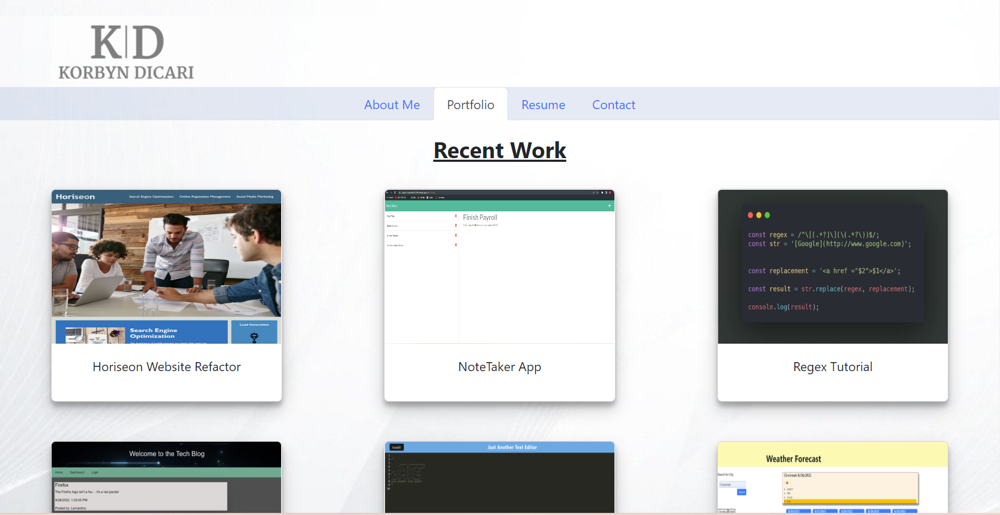

# My Portfolio

## Table of Contents

- [Description](#description)
- [Refrences](#references)
- [Videos](#videos)
- [Licenses](#license)
- [Author Info](#license)

## Description
* The purpose of this application was to create a dynamic portfolio to showcase my work and information to potential employers.

### Application Photo

## Install Instructions
none

## Credits
N/A

## Instructions/How to use

Link to Heroku Deployment: https://korbynd23.github.io/My-Portfolio/

* Upon arriving to the website, the homepage will display an about me section. You will be able to click on the nav bar and navigate to the pages desired. Portfolio will take you to a page with some of my highlighted work I've completed. Resume will provide you with a link to download/view my resume and lastly contact will show a form in which the user will be able to email me directly. 

## Videos:

N/A

## License
Permission to use this application is granted under the MIT license. https://choosealicense.com/licenses/mit/

## Created By
[github link: korbynd23](https://github.com/korbynd23)

#### If you have any further questions on this application please feel free to contact me at kdicari24@gmail.com

